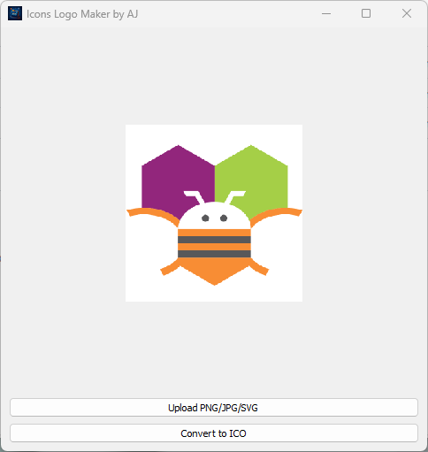

# 🖼️ icomaker.py

  
  


> ⚙️ A sleek PyQt5 GUI tool for converting PNG, JPG, or SVG images into `.ico` icon files — perfect for developers, designers, and anyone working on desktop branding or software deployment.

---

## 🔽 Download

📦 Latest release:  
➡️ [**Download Windows App (.exe)**](https://github.com/jentimanatol/icomaker/releases/latest)

💻 View the source:  
🔍 [**Browse all releases**](https://github.com/jentimanatol/icomaker/releases)

### 📁 Clone the Project

```bash
git clone https://github.com/jentimanatol/icomaker.git
cd icomaker
python icomaker.py
```

### ⚠️ Windows Defender Notice

> On some systems, **Windows Defender** or other antivirus tools may flag the `.exe` as suspicious. This is a common false positive for apps built with **PyInstaller**.

- ✅ This executable was **automatically built and signed** in the [GitHub Actions](https://github.com/features/actions) environment.
- 🔒 No third-party or malicious code is present.
- 🧼 You can inspect the full source code [here](https://github.com/jentimanatol/icomaker).

If needed, you can safely add the `.exe` to Defender's allowed list, or build it yourself using the provided source.

---

## 🧾 About This Project

**icomaker.py** is a lightweight, cross-format icon maker written in Python using `PyQt5`. It simplifies the process of turning images into `.ico` files for use in:

- Desktop applications
- Custom file associations
- Icon customization

The app supports `.png`, `.jpg`, `.jpeg`, and `.svg` inputs, and converts them to `.ico` with automatic resizing to 256×256.

---

## 🚀 Features

- 🖼️ Convert `.png`, `.jpg`, `.jpeg`, or `.svg` images into `.ico` format
- 🔃 SVG → PNG conversion using CairoSVG
- 📐 Automatic resizing to 256×256 for compatibility
- 🧼 Clean PyQt5 GUI layout with minimal dependencies
- 💾 Save to any custom directory

---

## ⚙️ Installation

### 🔧 Python dependencies

```bash
pip install PyQt5 pillow cairosvg
```

> If `cairosvg` fails to install using `pip`, try:

```bash
conda install -c conda-forge cairosvg
```

---

## ▶️ Run the App

```bash
python icomaker.py
```

---

## 📸 Screenshots

```markdown


```

---

## 📃 License

This project is licensed under the MIT License.

---

## 🙋‍♂️ Author

Developed by [Anatolie Jentimir](https://github.com/jentimanatol)  
🎨 Empowering creators with simple, effective tools

---
